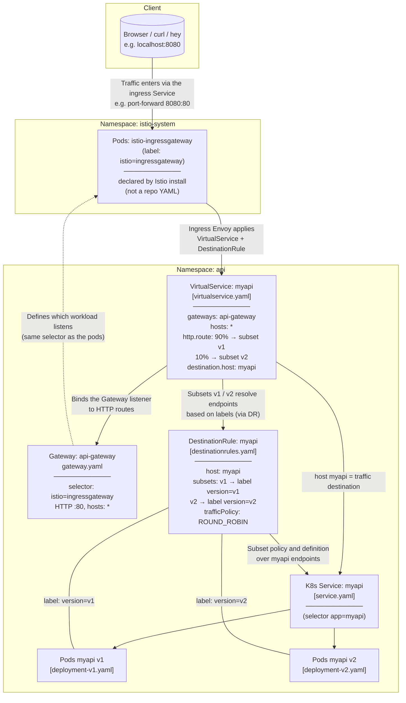

# Istio Basic

Welcome to **Istio Basic**.

This walkthrough uses Kubernetes, Istio, and Envoy-style traffic management to show how a small API is deployed, how plain `Service` load balancing behaves, and how Istio can change that story. Use it to experiment locally (for example with `kind`) before applying the same ideas elsewhere.

## Prerequisites

Confirm the following tools are available:

- Kind
- kubectl
- Istio (`istioctl`)
- `watch`
- `curl`
- `hey`

Run the environment check:

```sh
chmod +x ./scripts/setup
./scripts/setup
```

If the setup check passes, continue with step 1. Otherwise, install any missing tools. On macOS with Homebrew, for example:

```sh
brew install kind kubectl istioctl watch curl hey derailed/k9s/k9s
```

You also need a container runtime—**Docker** or **Podman** (either is enough for Kind):

```sh
brew install docker
```

or

```sh
brew install podman
```

## 1. Run the sample image locally

Run the same image we use in the cluster (`hashicorp/http-echo`) with Docker or Podman so you can see the response before Kubernetes is involved.

**Docker**

```sh
docker run --rm -p 5678:5678 hashicorp/http-echo -text="myapi v1"
```

**Podman**

```sh
podman run --rm -p 5678:5678 hashicorp/http-echo -text="myapi v1"
```

In another terminal:

```sh
curl http://localhost:5678
```

You should see something like `myapi v1`. When you are done, stop the container.

## 2. Create a Kubernetes cluster

Create a three-node Kind cluster on your machine using `kind/cluster-config.yaml`.

```sh
kind create cluster --name istio-basic --config kind/cluster-config.yaml
```


Point `kubectl` at that cluster:

```sh
kubectl cluster-info --context kind-istio-basic
```

## 3. Apply base manifests

Create shared resources (for example namespaces) used in later steps:

```sh
kubectl apply -f manifests/base/
```


## 4. Deploy the API and Service

Deploy **v1** and **v2** workloads plus the `myapi` `Service` (`deployment-v1.yaml`, `deployment-v2.yaml`, `service.yaml`). To watch objects and (once metrics-server is up) pod usage:

*Run the following command in a new terminal session and do not close it:*

```sh
watch -n 1 'kubectl get all,nodes -n api; echo ""; kubectl top pods --sort-by=cpu -n api'
```

> **Note:**  
> For a more interactive experience managing your Kubernetes resources, you can use [k9s](https://k9scli.io/).   
>  
> Run the following command to monitor and interact with objects in the `api` namespace:
>
> ```sh
> k9s --namespace api
> ```

Apply the API manifests in a new terminal:

```sh
kubectl apply -f manifests/api/deployment-v1.yaml
kubectl apply -f manifests/api/deployment-v2.yaml
kubectl apply -f manifests/api/service.yaml
```

If you encounter issues where the `watch kubectl get all,nodes ...` command shows an `ImagePullBackOff` error for the API pods, it likely means your local cluster cannot pull the images. To resolve this, run the following commands:

```sh
docker pull hashicorp/http-echo
docker pull istio/pilot:1.29.1
docker pull istio/proxyv2:1.29.1
docker pull registry.k8s.io/metrics-server/metrics-server:v0.8.1
kind load docker-image hashicorp/http-echo --name istio-basic
kind load docker-image istio/pilot:1.29.1 --name istio-basic
kind load docker-image istio/proxyv2:1.29.1 --name istio-basic
kind load docker-image registry.k8s.io/metrics-server/metrics-server:v0.8.1 --name istio-basic
```

This will ensure the required images are available locally and loaded into your Kind cluster.


**Port-forward** the Service so you can hit it from your laptop. The form is `LOCAL_PORT:SERVICE_PORT`: the **right-hand** port must be a `spec.ports[].port` on the Service (here **80** maps to container port **5678** via `targetPort`).

*Run the following command in a new terminal session and do not close it:*

```sh
kubectl port-forward -n api svc/myapi 4040:80
```

Then, in a new terminal:

```sh
curl http://localhost:4040
```


**Note:** Kube-proxy is an essential network agent component that runs on every node in a Kubernetes cluster. Its main function is to manage network rules to enable communication between pods and services, abstracting the complexity of the underlying network. It acts as a local load balancer, directing traffic to the correct pods.

## 5. Observe “no per-request” balancing

Run several requests:

```sh
for i in {1..20}; do curl http://localhost:4040; done
```

You will often see **only v1** (or a single backend) even though two ReplicaSets match the Service selector. That is expected for a default **`ClusterIP` Service**:

- Kubernetes balances at **layer 4** (TCP/UDP flows), **not** per HTTP request. There is no built-in “round-robin each `GET`” for a plain Service.
- **New TCP connections** are generally spread across ready endpoints (kube-proxy / datapath rules), but once a connection is pinned to a pod, **all HTTP requests on that connection** (HTTP keep-alive) go to the **same** pod.
- **`curl`** typically reuses connections to `localhost:4040`, so every request in the loop can share one connection and one backend—so you stay on v1 unless something opens new connections.

To make new TCP connections more likely (still L4 balancing, not L7 request routing), you can try:

```sh
for i in {1..20}; do curl --no-keepalive -s http://localhost:4040; done
```

You may still see uneven distribution; the point is that a raw Service is **not** an HTTP-aware load balancer. Per-request or canary-style routing is what we add later with **Istio** (VirtualService / subsets).


## 6. Metrics (metrics-server)

To use `kubectl top`, install **metrics-server**:

```sh
kubectl apply -f https://github.com/kubernetes-sigs/metrics-server/releases/latest/download/components.yaml
```

On Kind, patch the Deployment so it can scrape kubelets (TLS / address quirks):

```sh
kubectl patch deployment metrics-server -n kube-system --type='json' -p='[
  {"op": "add", "path": "/spec/template/spec/containers/0/args/-", "value": "--kubelet-insecure-tls"},
  {"op": "add", "path": "/spec/template/spec/containers/0/args/-", "value": "--kubelet-preferred-address-types=InternalIP,Hostname,ExternalIP"}
]'
```

That adds:

- `--kubelet-insecure-tls` — do not verify the kubelet serving certificate (common on local clusters; without it the Metrics API may stay `MissingEndpoints`).
- `--kubelet-preferred-address-types=InternalIP,Hostname,ExternalIP` — prefer reachable kubelet addresses when resolving nodes.


After the pod is ready, metrics should populate:


## 7. Load test with `hey`

```sh
hey -z 1m -c 400 http://localhost:4040
```

Plain Services still do **not** perform HTTP-level, per-request balancing. **`hey -c 400`** issues many concurrent requests, but you can still see **most CPU on one pod** in the metrics screenshot: **`kubectl port-forward`** and L4 kube-proxy rules do not spread load the way an L7 proxy (or Istio) does, and distribution is not “one request, one different pod.”


That pattern confirms we are not yet doing per-request load distribution at the HTTP layer; Istio in the next section is where you can shape traffic between v1 and v2 explicitly.

## 8. Install Istio and enable sidecar injection

Install the Istio control plane with **`istioctl`** (uses your current `kubectl` context):

```sh
istioctl install -y
```

> **:warning: Important:**  
> If you encounter issues after running the previous Istio installation command—such as pods failing to start or remaining in a pending state—it may be because the Istio control plane is requesting more memory than your node can provide. You can resolve this by **lowering the resource requests** for the Istio control plane. Patch the `istiod` Deployment to reduce its memory and CPU requirements:
> 
> ```sh
> kubectl patch deployment istiod -n istio-system -p '{"spec":{"template":{"spec":{"containers":[{"name":"discovery","resources":{"requests":{"memory":"512Mi","cpu":"100m"}}}]}}}}'
> ```
> 
> *This command sets the `istiod` container's resource requests to 512Mi of memory and 100m of CPU, which can help it fit on smaller clusters such as those running locally with Kind or Minikube.*


Then, enable automatic sidecar injection for the **`api`** namespace. Either label the namespace:

```sh
kubectl label namespace api istio-injection=enabled
```

Or add the label in `manifests/base/namespaces.yaml` and reapply:

```yaml
apiVersion: v1
kind: Namespace
metadata:
  name: api
  labels:
    istio-injection: enabled
```

```sh
kubectl apply -f manifests/base/
```

Restart the workloads so new pods pick up the sidecar:

```sh
kubectl rollout restart deployment -n api
```

Each pod now runs an extra **istio-proxy** (Envoy) sidecar alongside your app container. In the next steps, that proxy handles traffic into and out of the pod.


Now you can check the containers inside one of the pods you have in ```api``` namespace:

```sh
kubectl get pod <Pod name> -n api -o jsonpath='{range .spec.containers[*]}{.name}{"\n"}{end}'
```

* ```Pod name``` is something like: ```myapi-v1-6c9f58769-76g2g```

<!-- After the rollout, the mesh layout looks roughly like this:

 FIX THIS BECAUSE THE ISTIOD IS ALREADY INSTALL-->

## 9. Apply Istio networking resources

Sidecar injection alone is not enough: you still need Istio networking resources so the mesh can route and balance traffic the way Istio is meant to work.

Apply three resources in the **`api`** namespace:

- **`destinationrules.yaml`** — a **DestinationRule** for host `myapi` that defines **subsets** `v1` and `v2` (matched by the `version` pod label) and sets **round-robin** load balancing across endpoints in each subset.
- **`gateway.yaml`** — an **Gateway** named `api-gateway` that attaches to the default Istio ingress gateway (`istio: ingressgateway`) and accepts **HTTP on port 80** for any host (`*`).
- **`virtualservice.yaml`** — a **VirtualService** that binds that gateway to traffic for `myapi` and **splits HTTP traffic**: **90%** to subset `v1` and **10%** to subset `v2`.

```sh
kubectl apply -f manifests/istio/destinationrules.yaml
kubectl apply -f manifests/istio/gateway.yaml
kubectl apply -f manifests/istio/virtualservice.yaml
```

The ingress path through Istio looks like this:


Inspect the ingress gateway Service (it lives in **`istio-system`**, not in `api`):

```sh
kubectl get svc istio-ingressgateway -n istio-system
```

On Kind, `EXTERNAL-IP` often stays `<pending>`; use **port-forward** (next section) or the node’s **NodePort** to reach the gateway from your machine. You can watch Istio components and pod usage.

*Run the following command in a new terminal session and do not close it:*

```sh
watch -n 1 'kubectl get all -n istio-system; echo ""; kubectl top pods --sort-by=cpu -n istio-system'
```

> **Note:**  
> For a more interactive experience managing your Kubernetes resources, you can use [k9s](https://k9scli.io/).   
>  
> Run the following command to monitor and interact with objects in the `istio-system` namespace:
>
> ```sh
> k9s --namespace istio-system
> ```

### Istio Traffic Flow Diagram



**Why [gateway.yaml] looks “off” the main traffic arrow**

The **Gateway** CRD is **not** a proxy hop after `istio-ingressgateway`. Packets only traverse **Envoy** (ingress gateway pods, then sidecars). The **Gateway** resource **configures the ingress listener** (port, protocol, hosts, which workloads listen) via its **selector** (`istio: ingressgateway`). The **VirtualService** then **binds** HTTP routes to that listener through `gateways: api-gateway`. Istiod **merges** Gateway + VirtualService + DestinationRule into config on **the same** `istio-ingressgateway` Envoy—so the dashed **`GW -.-> IG`** line is a **configuration** edge (“who listens, on what”), and **`VS --> GW`** means **routes are attached to that Gateway’s listeners**, not “traffic flows VS → Gateway pod.”

**Why the diagram links DestinationRule (and VirtualService) to the Kubernetes Service**

It is easy to assume that Istio replaces the `Service`: mesh traffic is handled by **Envoy** (sidecars and the ingress gateway), and **subsets** in the DestinationRule pick versions by **labels**, so it can look as if pods talk “only through the proxy” and not through the `Service` object from [<service.yaml>].

That intuition is half right and half incomplete.

- **Data plane:** Packets do **not** need to flow through the Service `ClusterIP` the way they might with plain `kube-proxy`. Proxies send traffic toward **real pod endpoints**, often Envoy-to-Envoy.
- **Control plane / naming:** Your VirtualService and DestinationRule both use **`host: myapi`**. In Kubernetes, that host is the **Service name** `myapi` in the `api` namespace: it is how the mesh registry knows which logical upstream this is and which **workload instances** (pod IPs) belong to it. The Service’s **selector** defines that pool of pods; **subsets** then **split that pool** with extra labels (`version: v1` / `v2`). They do not invent a separate list of pods without the Service.

So the arrows toward **K8s Service: myapi** in the diagram mean **“policy and routing are bound to that service hostname and its endpoints,”** not “traffic hits ClusterIP first in a hop-by-hop sense.”

**For this tutorial, [<service.yaml>] is required.** Removing the Service would remove the usual registry entry and endpoints for `host: myapi`, and routing with your current Istio manifests would **stop working** unless you reintroduce another supported way to declare the same host and backends (for example advanced patterns like `ServiceEntry` / `WorkloadEntry`), which this walkthrough does not use.

## 10. Reach the API through the ingress gateway

Traffic now enters the mesh at **`istio-ingressgateway`**, where Envoy applies your **Gateway**, **VirtualService**, and **DestinationRule** subsets—so requests are steered at **HTTP layer 7** (weights, subsets), not only by a **plain `ClusterIP` Service** as when you port-forwarded straight to `myapi`. The **`myapi` Service** is still required: it remains **`host: myapi`** and the **endpoint source** for those rules; Istio adds **L7** routing on top of it.

**Port-forward** port **80** on Service **`istio-ingressgateway`** to your laptop (the next example uses **8080:80**).

*Run the following command in a new terminal session and do not close it:*

```sh
kubectl port-forward -n istio-system svc/istio-ingressgateway 8080:80
```

In another terminal, send several requests:

```sh
for i in {1..20}; do curl http://localhost:8080; done
```

You should see a mix of backends, roughly in line with the weights in your VirtualService—for example:

```text
myapi v1
myapi v1
myapi v2 (second version)
```

With the default manifest, expect about **90%** responses from **v1** and **10%** from **v2**. That split comes from **Istio** (Gateway, VirtualService, DestinationRule), not from per-request behavior of a plain `ClusterIP` Service alone.

## 11. Change the traffic split

To experiment, edit `manifests/istio/virtualservice.yaml` and set **equal weights** for **v1** and **v2** (the `http.route` block):

```yaml
  http:
  - route:
    - destination:
        host: myapi
        subset: v1
      weight: 50
    - destination:
        host: myapi
        subset: v2
      weight: 50
```

Apply the change:

```sh
kubectl apply -f manifests/istio/virtualservice.yaml
```

Exercise the gateway again (with port-forward still running on **8080**):

```sh
for i in {1..20}; do curl http://localhost:8080; done
```

You should see a **roughly 50/50** mix between **`myapi v1`** and **`myapi v2 (second version)`** given enough requests.

Then run a longer load test:

```sh
hey -z 1m -c 400 http://localhost:8080
```

Compare pod CPU or request metrics with the earlier “plain Service” run:


With this setup, traffic is balanced at the HTTP layer:


## Tear down

**Istio networking resources**

```sh
kubectl delete -f manifests/istio/destinationrules.yaml
kubectl delete -f manifests/istio/gateway.yaml
kubectl delete -f manifests/istio/virtualservice.yaml
```

**metrics-server** (optional)

```sh
kubectl delete -f https://github.com/kubernetes-sigs/metrics-server/releases/latest/download/components.yaml
```

**API workloads, Service, and Namespace**

```sh
kubectl delete -f manifests/api/deployment-v1.yaml
kubectl delete -f manifests/api/deployment-v2.yaml
kubectl delete -f manifests/api/service.yaml
kubectl delete -f manifests/base/namespaces.yaml
```

**Kind cluster**

```sh
kind delete cluster --name istio-basic
```

To remove the Istio control plane itself, use `istioctl uninstall --purge` (see `istioctl uninstall --help`) after deleting custom resources that reference it.
